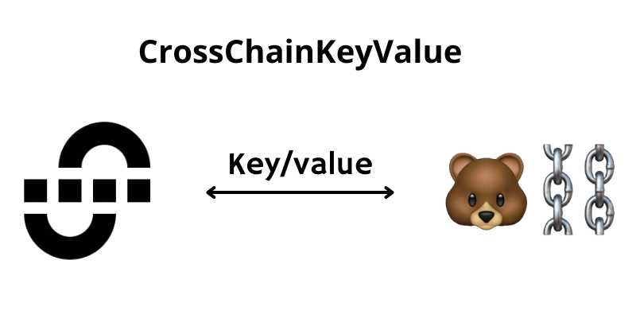

# CrossChainKeyValue

## Description

The **CrossChainKeyValue** project is a smart contract that enables key/value data exchange between different blockchains using the IBC (Inter-Blockchain Communication) protocol.

### Objective

The objective of this project is to create a simple application that demonstrates cross-chain communication using IBC. The application sends a key to a destination blockchain and receives the associated value in return.

### How It Works

1. **Sending the Key**: The contract sends a message containing the key to the destination blockchain.
2. **Receiving the Value**: The destination blockchain returns the value associated with the received key.

