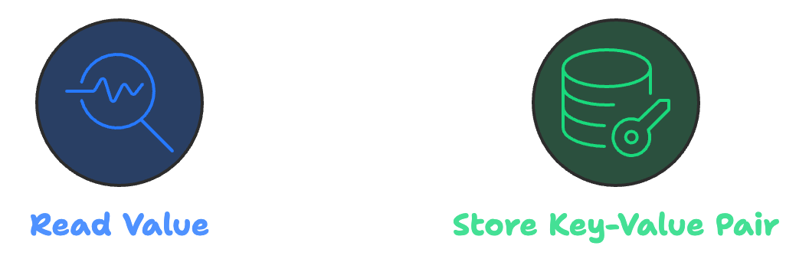

# CrossChainKeyValue

## 📖 Description

The **CrossChainKeyValue** project is a smart contract that facilitates key/value data exchange between different blockchains using the IBC (Inter-Blockchain Communication) protocol.

## 🚀 Functionalities

This project provides **two main functionalities**:

### 1. Read Value

- Sends a request to another blockchain to read the value associated with a specific key.

### 2. Store Key-Value Pair

- Stores a key-value pair on the target blockchain.

## 🎯 Objective

The objective of this project is to create a simple application that demonstrates cross-chain communication using IBC. The application sends a key to a destination blockchain and receives the associated value in return.

## 🛠️ How It Works

1. **Sending the Key**:
   - The contract sends a message containing the key to the destination blockchain for either reading or writing a value.
   
2. **Receiving the Response**:
   - The destination blockchain responds with the value associated with the key or confirms the storage of the key-value pair.

## 🔗 Encoding with `ethabi`

For encoding and decoding the data, we utilize the `ethabi` library. The data is organized in **32-byte blocks**, following the Ethereum ABI standard. Below is the structure for both operations:

